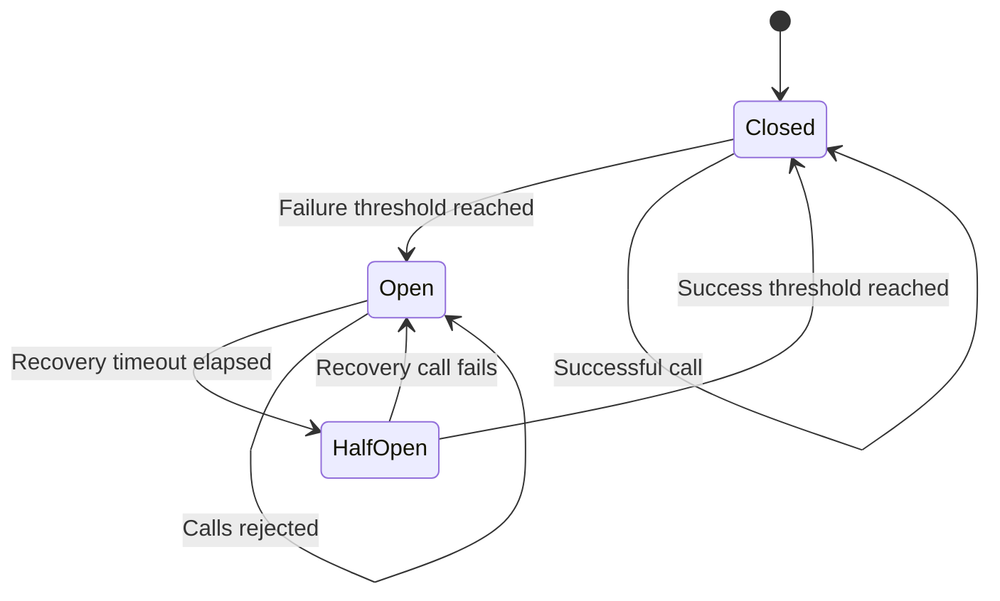

# Distributed Circuit Breaker

## Overview

The Distributed Circuit Breaker protects the Enterprise AI Platform Runtime from repeatedly calling an unhealthy downstream dependency.

The initial registered circuit breaker protects Ollama-based AI generation operations. The implementation is reusable and can also protect databases, external APIs, model providers, vector stores, and other remote services.

Unlike an in-memory circuit breaker, this implementation stores state in Redis. Multiple API and worker instances therefore share the same circuit state and make consistent resilience decisions.

## Problem Statement

A downstream service may become unavailable, slow, overloaded, or intermittently unhealthy.

Without a circuit breaker, every application instance may continue sending requests to the failing dependency. This can cause:

- Increased request latency
- Thread or connection exhaustion
- Cascading failures
- Repeated timeout costs
- Additional pressure on an already unhealthy service
- Reduced platform availability

The circuit breaker fails fast while the dependency is unhealthy and periodically allows controlled recovery attempts.

## State Machine

